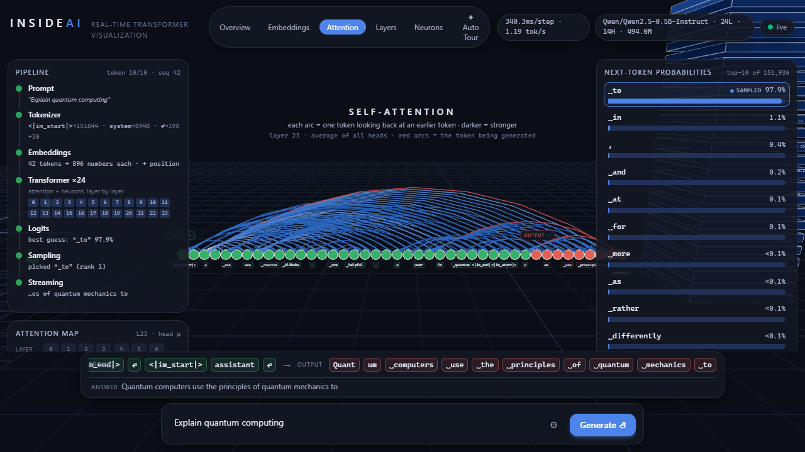
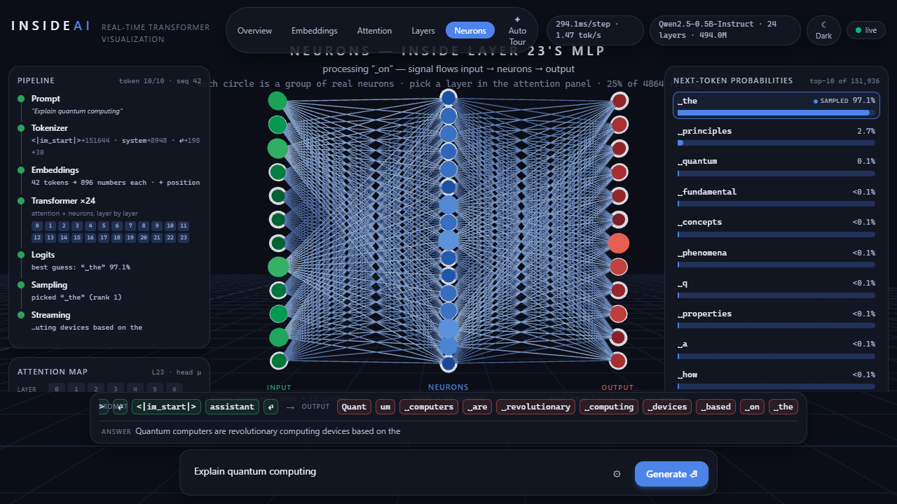
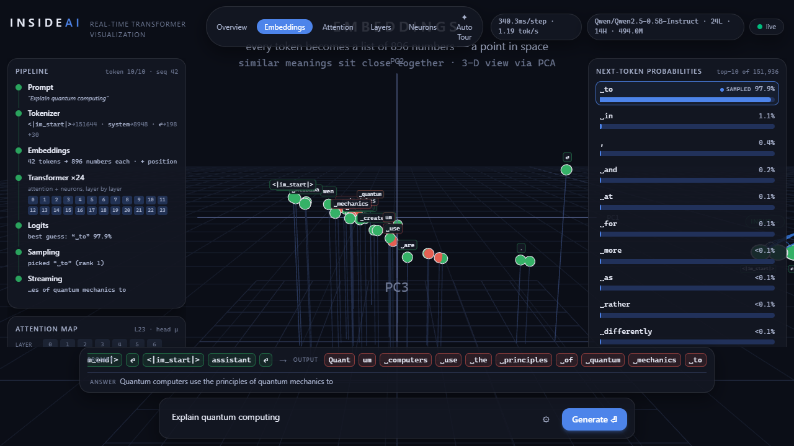
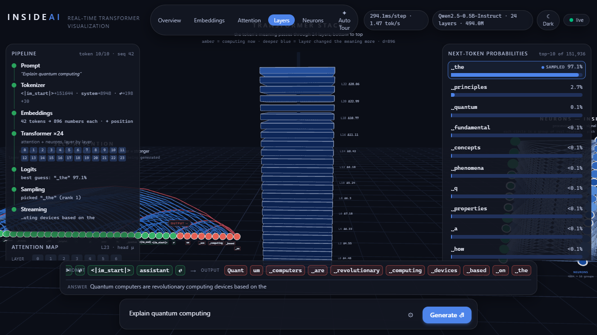
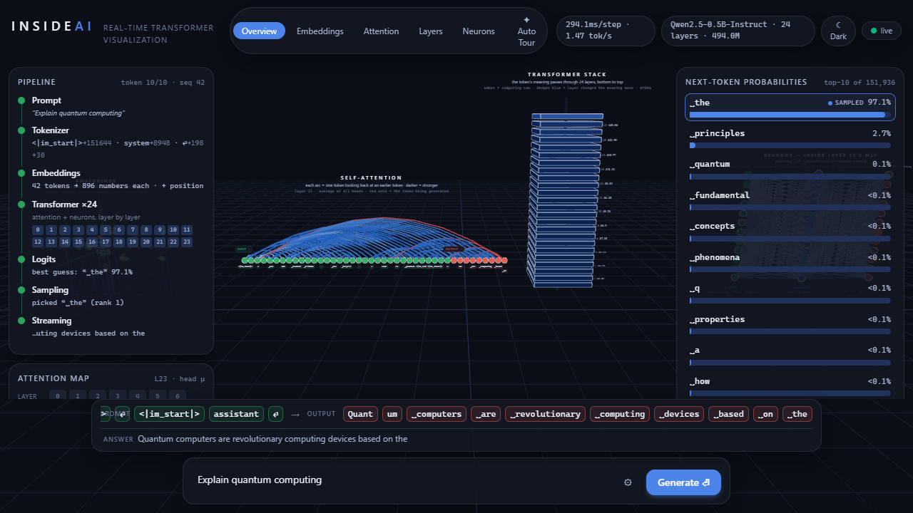

# InsideAI

*Forked from [Jeba-Jebarsan/insideai](https://github.com/Jeba-Jebarsan/insideai)
(MIT). Extended into a live LLM flight-recorder / telemetry viewer — a
per-layer anomaly/telemetry pipe on top of the original 3D visualization.*

**Watch a real AI model think.** InsideAI runs a genuine language model on
your machine and turns every step of its computation into a live, interactive
3D visualization — tokenization, embeddings, attention, neurons firing,
probabilities, sampling, and the answer streaming out. No videos, no papers,
no mock data: what you see is the model, running.



## Is there a real LLM behind this?

**Yes.** By default InsideAI runs **Qwen2.5-0.5B-Instruct** (494M parameters,
24 layers) locally in the Python backend — it actually answers your prompt.
Every visual is driven by tensors extracted from its live forward pass:

- attention arcs and heatmaps are the model's real `softmax(QKᵀ/√d)` matrices
- the neuron diagram lights up with actual GELU/SiLU activations, wired by
  the model's true weight matrices
- probability bars are the exact distribution the sampler draws from
- the layer stack glows by how much each layer really changed the token's
  meaning (‖Δresidual‖)

Where data must be reduced to fit a screen (4864 neurons → 128 groups, 896
dimensions → 3 PCA axes), the reduction is documented and labeled in the UI —
never invented. Details: [docs/ARCHITECTURE.md](docs/ARCHITECTURE.md).

`Qwen/Qwen2.5-0.5B-Instruct` is the configured default
(`backend/app/config.py`). `distilgpt2` is the model this fork's telemetry
pipe has actually been run and smoke-tested against (see below) — set
`INSIDEAI_MODEL=distilgpt2` for the fastest, most-verified path. Any other
GPT-2- or Llama-family causal LM should work per the engine's family
detection, but hasn't been exercised with the telemetry hook here.

## What you'll see

| | |
|---|---|
|  | **Neurons** — the classic textbook network, live: green input → blue hidden neurons → red output. Wire brightness = real connection strength × the signal flowing through it, one pulse per generated token. |
|  | **Embeddings** — every token becomes a point in space (PCA view of the real vectors); similar meanings sit close together. |
|  | **Layers** — the transformer stack. Amber = computing right now; deeper blue = that layer changed the meaning more. |
|  | **Pipeline** — the whole journey with live examples: words → token ids → vectors → 24 layers → scores → one word chosen → text streaming out. |

Plus a per-head attention heatmap, top-10 probability panel with the sampled
token highlighted, a token stream (green = your prompt, red = generated), and
an **Auto Tour** that flies the camera through the pipeline once per
generation.

## Live telemetry — the flight-recorder pipe

On top of the original visualization, every layer of every generation step
now streams a real telemetry reading over the same WebSocket:

- **`zeta_raw`** (wire name: `zeta_proxy`) — a signed cross-layer coherence
  reading taken from the model's own activations during the forward pass
  that's already happening (no extra inference). Sourced from
  [unitarity-lab](https://github.com/holeyfield33-art/unitarity-lab)'s
  `PassiveTelemetryHook`, which wraps the model in passive mode (it observes,
  it never mutates a tensor).
- **`flagged`** — a calibrated anomaly flag, true when the hook's internal
  `spectral_gap` metric looks like a rupture rather than normal variation.
  It comes from [VAR](https://github.com/holeyfield33-art/VAR)'s
  `SpectralRuptureDetector` (median/MAD baseline with hysteresis), which
  `PassiveTelemetryHook` calls out to rather than reimplementing.
  `spectral_gap` itself feeds that detector internally; it isn't currently
  forwarded onto the WebSocket, only `zeta_proxy` and `flagged` are.
- **The anomaly/EKG HUD panel** (`AnomalyEkgPanel.tsx`) — a live sparkline of
  `zeta_proxy` plus a per-layer chip row, so you can see which layer produced
  the most recent reading as generation runs.

One reading is taken per forward pass and shared across every layer in that
step — a real per-step signal, not a fake per-layer value. Verified live on
Linux: `distilgpt2`, `ws_smoke_test.py` — PASS, 18 real `anomaly` events
across 3 decode steps, `zeta_proxy` changing step to step (e.g.
`0.999 → 0.906 → 0.879`), not a static ratio. See
`backend/app/model/engine.py` (`_extract_layers`) and
`backend/app/streaming/protocol.py` (the `anomaly` event) for the exact wiring.

## Quick start

Requirements: **Python 3.11+**, **Node 20+**, ~2 GB disk for the model
(downloaded once from HuggingFace on first start). Commands below are for
Linux / macOS / GitHub Codespaces; a Windows PowerShell variant follows.

> **Windows prerequisite:** torch requires the Microsoft Visual C++
> Redistributable. If `pip install` succeeds but the backend fails at
> startup with `OSError: [WinError 126] ... c10.dll`, install
> `vc_redist.x64.exe` from Microsoft
> (https://aka.ms/vs/17/release/vc_redist.x64.exe), then relaunch.
> This requires an interactive admin (UAC) approval — it cannot be
> done in a non-interactive/CI shell without a preinstalled runtime.

**Terminal 1 — backend:**

```bash
cd backend
python3 -m venv .venv
.venv/bin/pip install -r requirements.txt
.venv/bin/python run.py                    # ws://127.0.0.1:8000/ws
# fastest boot for a quick check:
# INSIDEAI_MODEL=distilgpt2 .venv/bin/python run.py
```

**Terminal 2 — frontend:**

```bash
cd frontend
npm install
npm run dev
```

Open **http://localhost:3000**, type a prompt, press **Generate**.

<details>
<summary>Windows (PowerShell)</summary>

```powershell
cd backend
python -m venv .venv
.venv\Scripts\pip install -r requirements.txt
.venv\Scripts\python run.py
```

Or run both servers at once with `scripts\dev-all.ps1`.
</details>

## Using it

| Control | What it does |
|---|---|
| **Generate / Stop** | run the model on your prompt / cancel mid-generation |
| **Overview · Embeddings · Attention · Layers · Neurons** | fly the camera to a zone (and stay there) |
| **✦ Auto Tour** | one guided camera pass through the pipeline per generation |
| **Attention panel** | pick any layer and head; hover the heatmap for exact query→key weights |
| **⚙ settings** | tokens, temperature, top-k, top-p, repetition penalty, Chat/Raw mode, pacing (Cinematic/Fast/Instant), seed |
| **☾ / ☀** | dark ↔ light theme (both colorblind-validated) |
| **Chat vs Raw** | Chat applies the model's chat template (it answers you); Raw continues your text |
| **seed** | fixed seed → identical run, great for demos |

## Configuration

Backend env vars (defaults in parentheses):

| Var | Purpose |
|---|---|
| `INSIDEAI_MODEL` (`Qwen/Qwen2.5-0.5B-Instruct`) | any GPT-2- or Llama-family causal LM — try `distilgpt2` (fastest), `gpt2`, `TinyLlama/TinyLlama-1.1B-Chat-v1.0` |
| `INSIDEAI_DTYPE` (`bfloat16`) | `float32` for exactness, bf16 halves RAM |
| `INSIDEAI_THREADS` (half your cores) | CPU threads for the model — leaves headroom for the browser |
| `INSIDEAI_PORT` (`8000`) · `INSIDEAI_DEVICE` (`cpu`) | server basics; `cuda` if you have a GPU PyTorch build |
| `INSIDEAI_MAX_PROMPT_TOKENS` (64) · `INSIDEAI_MAX_NEW_TOKENS` (96) | sequence budgets |

Frontend: `NEXT_PUBLIC_WS_URL` (`ws://127.0.0.1:8000/ws`).

## Dependencies

Two of this fork's telemetry dependencies are pinned to exact commits (not
version ranges) for reproducibility — the WebSocket telemetry above is only
as trustworthy as the code producing it:

| Package | Pinned to | Why |
|---|---|---|
| [`unitarity-lab`](https://github.com/holeyfield33-art/unitarity-lab) | `1dfe4e52771eb2fd82f4def61d1e740f3c61b77d` (in `backend/requirements.txt`) | source of `PassiveTelemetryHook` / `zeta_raw` |
| [`VAR`](https://github.com/holeyfield33-art/VAR) | `31234551e524249a5e81453ec851c98ec8836fb7` (unitarity-lab's own pin, installed transitively) | source of `SpectralRuptureDetector` / `flagged` |

## Testing

Requires a backend already running (see Quick start) and, for the two
WebSocket tests, the `websockets` package in the backend venv
(`.venv/bin/pip install websockets`).

```bash
# protocol test — asserts properties only true of real transformer internals
# (causal masks, stochastic attention rows, decode rows, wiring shapes,
# and one real `anomaly` event per layer per step)
backend/.venv/bin/python backend/scripts/ws_smoke_test.py

# settings test — proves the knobs behave (T=0 is greedy, fixed seed
# reproduces identical tokens, top-k filters, chat/raw templates)
backend/.venv/bin/python backend/scripts/params_test.py

# browser end-to-end (needs both servers running)
cd frontend && npm run test:e2e
```

Note: `scripts/e2e.js` launches Playwright with `channel: "msedge"`, so
`test:e2e` needs Microsoft Edge installed — true on the original Windows dev
box, not on a bare Linux/Codespaces container (only Chromium ships there).
The two backend WebSocket tests above have no such dependency and are what
this fork's telemetry changes were actually verified against on Linux.

## How it works (short version)

The backend loads the model with eager attention (`output_attentions=True`)
and runs **prefill + KV-cache decode** like a production inference engine:
the prompt yields full attention matrices once, then each new token streams
its attention rows, pooled MLP activations (captured with forward hooks),
hidden-state norms, top-10 logits and the sampling decision over a WebSocket.
The frontend batches events per animation frame into a zustand store; the 3D
scene and HUD read from it. Full details, protocol table and the list of
honest reductions: [docs/ARCHITECTURE.md](docs/ARCHITECTURE.md).

```
Prompt → Tokenizer → Embeddings (+position) → [ attention + MLP ] × 24
      → Logits → Sampling → next token → … → Streaming answer
```

## Project structure

```
backend/
  app/config.py                env-tunable settings
  app/main.py                  FastAPI + /ws session handling
  app/model/engine.py          model loading, hooks, prefill/decode traces, sampling,
                                unitarity-lab PassiveTelemetryHook wiring
  app/model/reduce.py          PCA / pooling / quantization (documented reductions)
  app/streaming/protocol.py    trace → ordered, paced event stream, incl. `anomaly` events
  scripts/ws_smoke_test.py     protocol invariants test (incl. anomaly events)
  scripts/params_test.py       generation-settings behavior test
frontend/
  src/lib/                     types (protocol mirror), store, ws client, validated palette
  src/components/hud/          pipeline, heatmap, probabilities, token stream, controls,
                                AnomalyEkgPanel.tsx (telemetry/EKG panel)
  src/components/scene/        R3F: embeddings, attention arcs, layer tower, neuron diagram
  scripts/e2e.js               headless-browser end-to-end test (needs msedge)
docs/ARCHITECTURE.md           deep dive
```

## Troubleshooting

- **First start is slow** — the model downloads once into the HF cache.
- **Port 8000 busy** — set `INSIDEAI_PORT` and `NEXT_PUBLIC_WS_URL`.
- **Slow generation** — close heavy apps (screen recorders, many browser
  tabs); the model shares your CPU. `INSIDEAI_MODEL=distilgpt2` is ~6× smaller.
- **`attentions` empty on a custom model** — keep `attn_implementation="eager"`.

## Contributing & license

PRs welcome — see [CONTRIBUTING.md](CONTRIBUTING.md). The one hard rule:
**no fake data.** [MIT](LICENSE).
